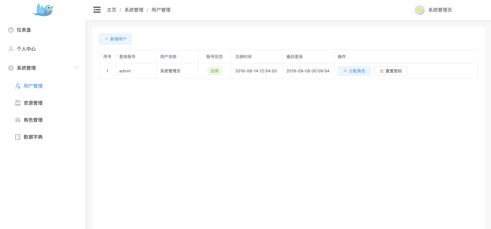
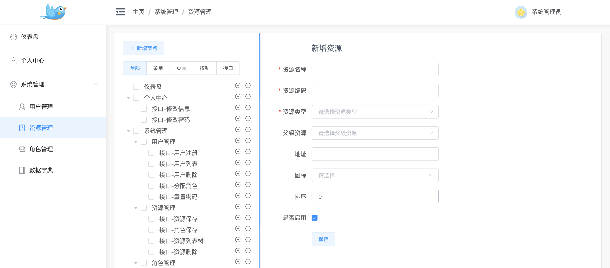
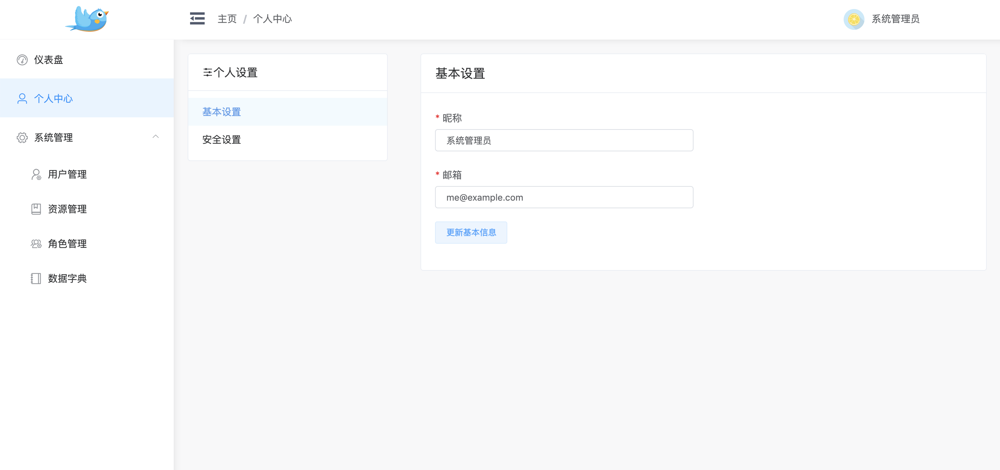

# nkm后台管理系统初始化模版-后端

> 此项目是学习nodejs做后台写的，目前已经完成基础权限功能，整体权限关联过程为：用户关联角色，角色关联资源，后端接口请求通过redis缓存当前用户的接口请求地址，每次请求通过koa的中间件进行拦截判断

> 目前也是正在学习mysql这些后端知识，欢迎各位指点，谢谢🤓

> 后端使用Nodejs + Koa2 + Mysql + Redis完成

## 使用前提

* 本地需要`mysql`与`redis`环境

* 克隆代码到本地
  `git@github.com:nkm-admin/nkm-server.git`

* 导入mysql
  将项目根目录的`nkm_admin.sql`导入至数据库，admin账号默认密码：123456

## 安装项目依赖
```
yarn
or
npm install
```

### 启动项目

> 项目默认端口为：3333

```
yarn start
or
npm run start
```

# 部分截图

* 登录


* 用户列表


* 资源管理


* 用户信息更新

